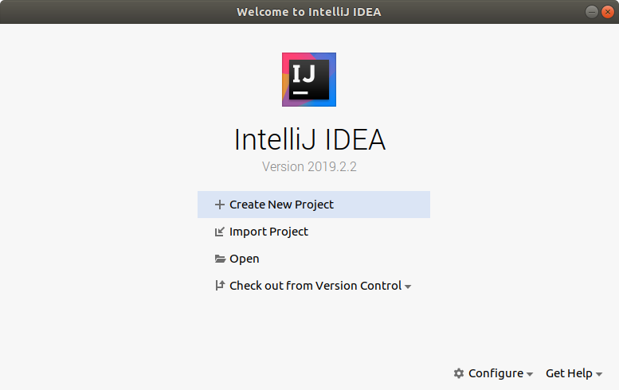
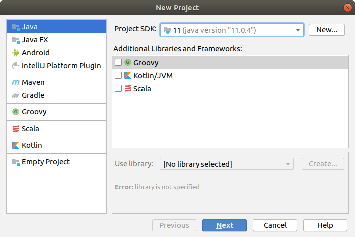
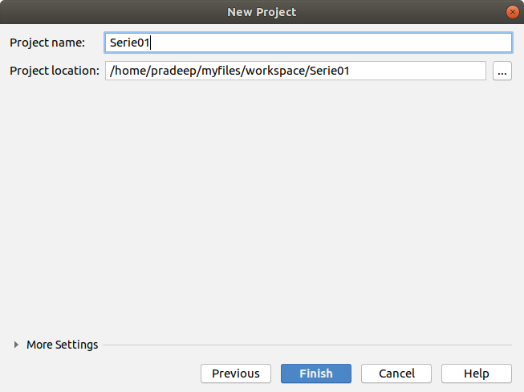
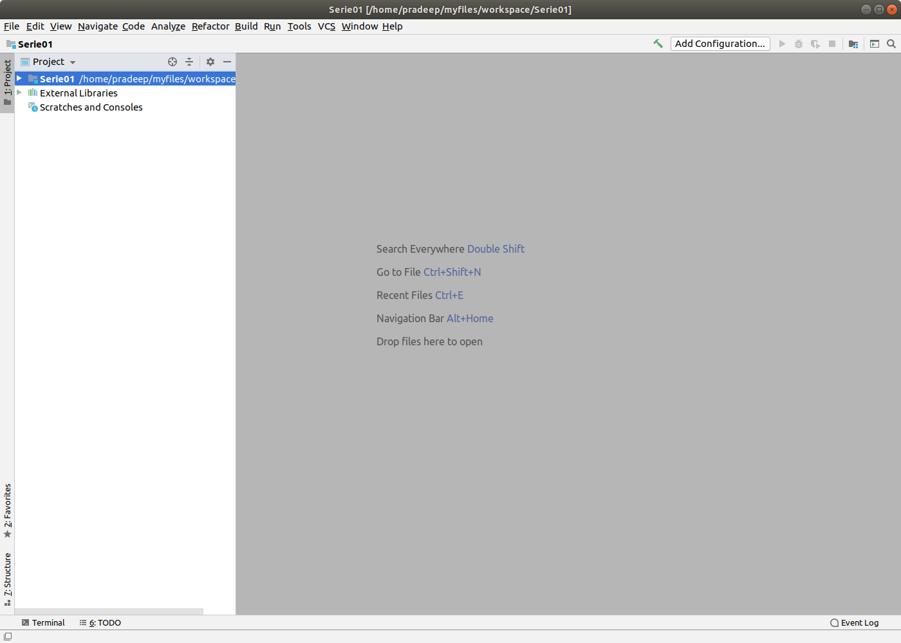

**Goal : This is the first IntelliJ tutorial. It shows how to create a workspace and a project**

To write a Java program, you will need the development environment of this language (Java Development Kit (JDK)). This environment is free and contains a number of basic commands that you can run in a terminal: for example javac , which compiles a program, and java , to run it.
Working with command lines can however be relatively uncomfortable and difficult for beginners. So we could use an Integrated Development Environment (IDE). In this guide we will use IntelliJ IDEA.

**IntelliJ** is an application layer above the Java Development Kit that simplifies editing, compiling and running Java applications.

#### IntelliJ basic configuration
Start IntelliJ using IntelliJ launch icon(press `windows key` and search for **intellij** )

A welcome dialog box will appear. Among the options choose `create new project`.

New project dialog box will appear. Set `Project_SDK` to Java 11 and click next until you reach the project name settings.

Next, set project name to `Serie01` (next week you will put "Serie02" etc) and use the following the path for the workspace (we will explain what a workspace is) as suggested by the figure below (*where 'pradeep' has been replaced by your own user name and "myfiles" must be included*). Then select `Finish`.

You will then see a default workspace of IntelliJ similar as shown in figure below. You are now in the created workspace. The panel on left side show the project navigator which show the files in project directory. The main panel in the middle will be used for code-editor.

