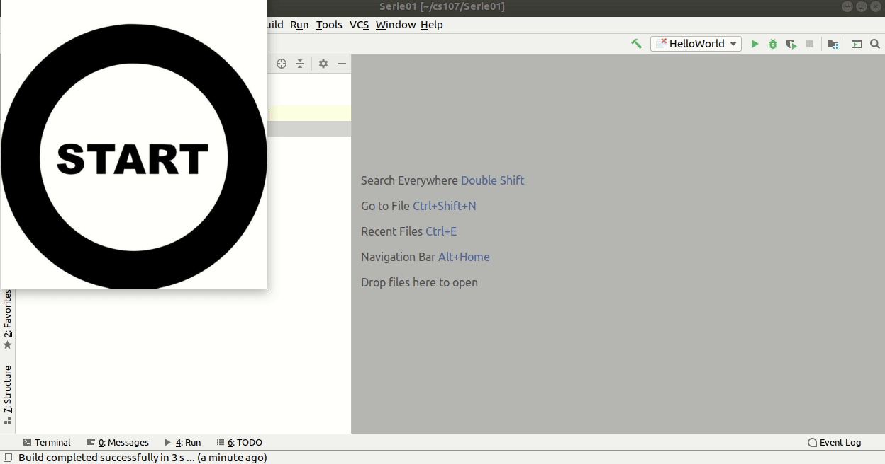
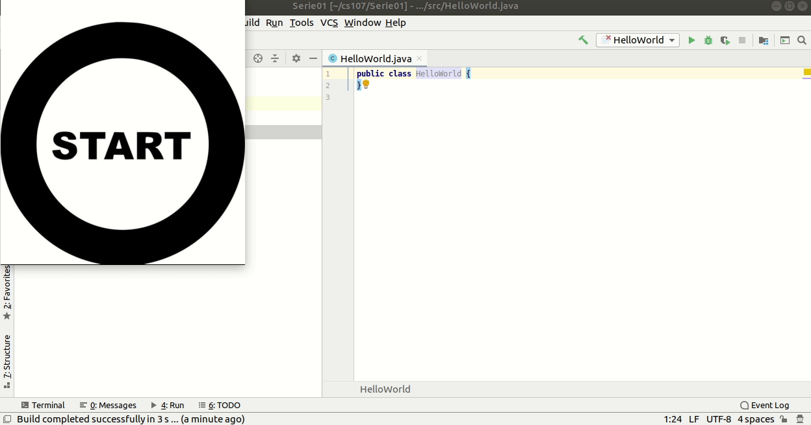
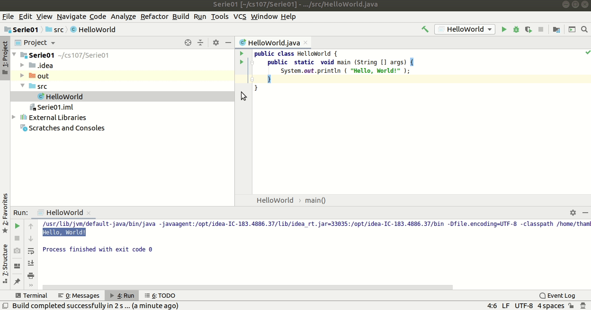
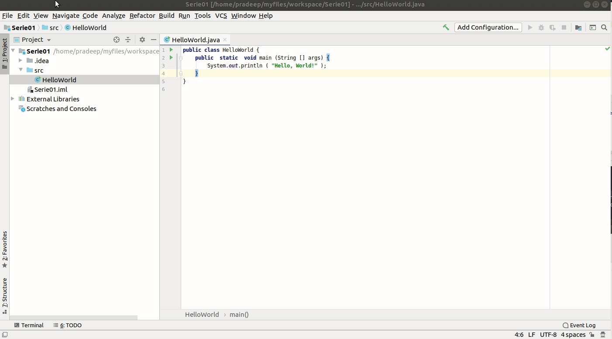
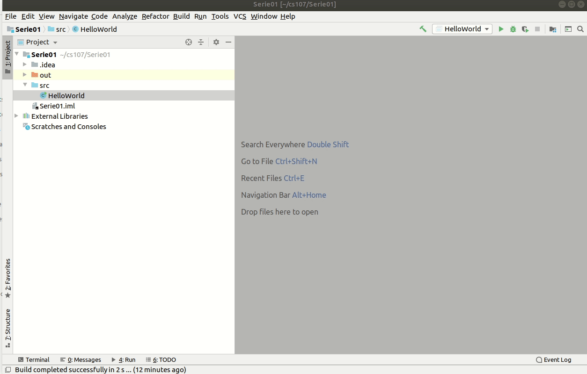

**Goal : This tutorial show how to create and run "Hello World!" in IntelliJ**

You will create your first little Java application: the little program will display "Hello, World!" on the screen.

First create a `Serie02` project in IntelliJ . If you do not remember how to refer to the [this IntelliJ tutorial](./basic_configuration.md)
After creating `Serie02` project, right-click over `src` (in project Project navigator, under Serie02).
In the menu that appears, select "New-> Java Class". Then name the class to `HelloWorld` and press Enter. A new file `HelloWorld.java` is created and opened in the code-editor :



Now copy the following code between the opening and closing braces of `HelloWorld` class **{** and **}**. To save the file press `Ctrl` + `s` or `File->save All`

```java
public  static  void main (String [] args) {
     System.out.println ( "Hello, World!" );
 }
```

After copying, run button(green triangle) will appear next to the first line of `HelloWorld` class. Press this run button and select `Run HelloWorld.main()`. You can also run the program through menu: `Run->Run...`. Run panel will appear in bottom and text `Hello, World!` will be printed there.



#### Enabling line numbers
If line numbers are not enabled in IntelliJ, you can enable it as follows.



#### Setting the character encoding
This procedure is necessary to avoid any problem with accented characters. Goto `File->Setting` and search for encoding. Then select `File encoding` and set `Global encoding` and `Project Encoding` to `UTF-8` from the drop-down menu.




#### Setting the termination of lines
This part is also necessary to avoid any problem of compatibility with the automatic corrector used in this course. Goto `File->Setting` and then select `Editor-> code style`. Then set `Line seperator` to Unix.



